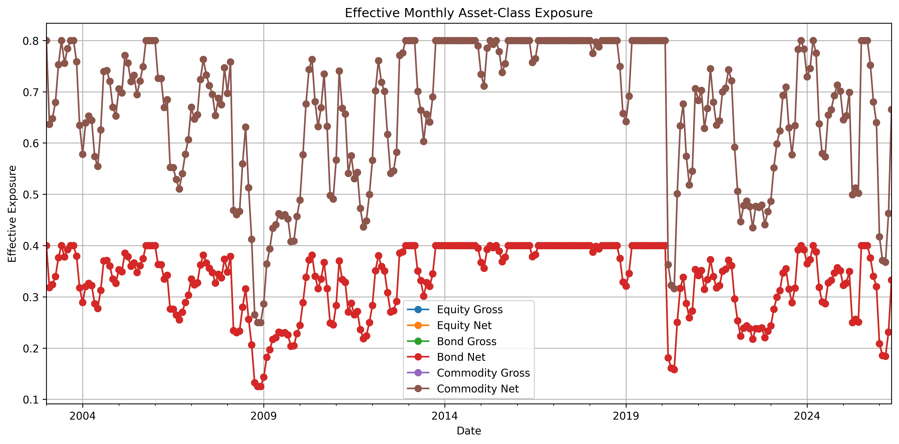
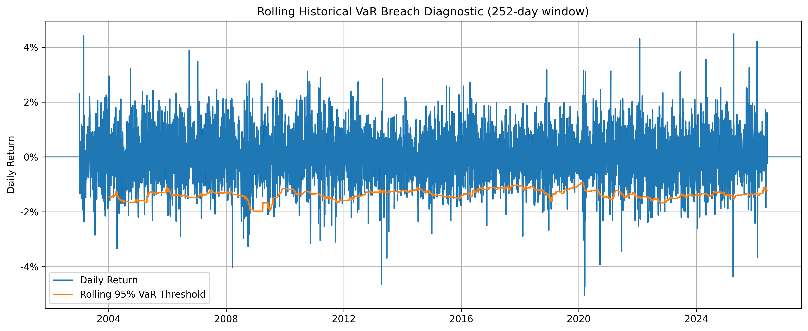

# Market Risk Framework for a Multi-Asset Futures Portfolio

## Overview

This project builds a market-risk framework for a diversified multi-asset futures portfolio. The strategy combines futures-based exposure across equities, bonds, and commodities with monthly rebalancing, volatility targeting, implementation-cost modelling, VaR backtesting, Expected Shortfall diagnostics, and stress testing.

The purpose of the project is to evaluate a systematic futures strategy through an institutional risk-management lens, rather than only reporting backtested returns. The analysis focuses on performance, drawdowns, tail losses, VaR exceptions, Expected Shortfall severity, asset-class exposure, and implementation costs.

---

## Research Objective

The project asks the following question:

> Can a diversified volatility-targeted futures portfolio generate competitive long-run risk-adjusted returns while reducing equity-market dependence and providing a transparent market-risk framework?

The analysis evaluates this through:

* Long-run performance versus benchmarks
* Drawdown and underwater analysis
* Rolling Sharpe diagnostics
* Asset-class exposure monitoring
* Historical VaR breach testing
* Formal Kupiec and Christoffersen VaR tests
* Expected Shortfall severity diagnostics
* Scenario and stress testing
* Transaction-cost modelling

---

## Strategy Design

The core portfolio is built from futures contracts across three asset classes:

* Equity index futures
* Treasury futures
* Commodity futures

The strategy applies:

* Equal-weight initial allocation across the futures universe
* Monthly rebalancing
* Volatility targeting
* Leverage constraints
* Transaction-cost assumptions by contract
* Risk-free-rate adjustment
* Net-of-cost performance evaluation

The strategy is compared against:

* SPY Buy & Hold
* 60/40 SPY/IEF monthly rebalanced benchmark
* Equal-weight futures basket
* Inverse-volatility futures basket
* Simple time-series momentum futures benchmark
* Managed-futures ETF proxies

---

## Repository Structure

```text
Market-Risk-Framework-for-a-Multi-Asset-Futures/
├── README.md
├── figures/
│   ├── asset_class_exposure_main_window.png
│   ├── drawdown_main_window copy.png
│   ├── equity_curve_main_window copy.png
│   ├── rolling_sharpe_main_window copy.png
│   ├── rolling_var_breach_diagnostic_main_window.png
│   └── underwater_plot_main_window copy.png
└── tables/
    ├── all_project_tables.xlsx
    ├── cost_summary.csv
    ├── es_severity_table.md
    ├── formal_var_95 copy.csv
    ├── formal_var_99 copy.csv
    ├── risk_table.csv
    ├── scenario_table copy.csv
    └── stats copy.csv
```

---

## How to run
## How to run

This repository is designed so the results can be reviewed directly from the README, while the full analysis can be reproduced from the notebook.

### 1. Clone the repository

```bash
git clone https://github.com/<your-username>/Market-Risk-Framework-for-a-Multi-Asset-Futures.git
cd Market-Risk-Framework-for-a-Multi-Asset-Futures
```

### 2. Create a virtual environment

```bash
python -m venv .venv
source .venv/bin/activate
```

On Windows:

```bash
.venv\Scripts\activate
```

### 3. Install dependencies

```bash
pip install pandas numpy matplotlib scipy yfinance openpyxl jupyter
```

The project uses:

* `pandas` and `numpy` for return construction, portfolio calculations, and table generation
* `yfinance` for public market data
* `matplotlib` for figures
* `scipy` for formal VaR backtesting tests
* `openpyxl` for Excel table export
* `jupyter` to run the notebook interactively

### 4. Run the notebook

Open Google Colab, then run the project notebook from top to bottom.

The notebook downloads futures and benchmark data, constructs the strategy, applies volatility targeting, models transaction costs, runs performance diagnostics, performs VaR and Expected Shortfall testing, and generates stress-test outputs.


### 5. Notes on reproducibility

The analysis uses publicly available Yahoo Finance data. Because the data is downloaded live through `yfinance`, results may differ slightly over time due to data revisions, ticker availability, or changes in adjusted price history.

The backtest is intended as a research and risk-management framework, not a production trading system. The transaction-cost, financing, liquidity, and futures-roll assumptions are simplified and should be reviewed before any live implementation.


---

## Headline Results

| Metric             | Strategy Net | SPY Buy & Hold | 60/40 SPY/IEF |
| ------------------ | -----------: | -------------: | ------------: |
| Annual Return      |       10.88% |         11.71% |         8.91% |
| Annual Volatility  |       13.96% |         18.65% |        10.74% |
| Sharpe Ratio       |         0.69 |           0.60 |          0.69 |
| Max Drawdown       |      -29.61% |        -55.19% |       -31.38% |
| Beta to SPY        |         0.32 |           1.00 |          0.56 |
| Correlation to SPY |         0.43 |           1.00 |          0.97 |
| Total Return       |     1002.71% |       1212.72% |       626.86% |

The strategy does not beat SPY on absolute annual return. Its value comes from a more diversified return stream, lower volatility, lower equity beta, and a smaller maximum drawdown.

Full table: [`tables/stats copy.csv`](tables/stats%20copy.csv)

---

## Equity Curve


The net strategy compounds strongly over the main sample and performs competitively versus the benchmark set. The gross strategy is above the net strategy, as expected after transaction costs.

The key interpretation is that the futures strategy offers a differentiated return profile rather than simply replicating equity beta.

---

## Drawdown Analysis


The strategy has a materially lower maximum drawdown than SPY. However, the drawdown chart also shows that the strategy still experiences meaningful losses during stressed market regimes.

This is important because volatility targeting reduces risk, but it does not eliminate drawdown risk.

---

## Underwater Plot


The underwater plot shows how long the strategy remains below prior highs.

This is useful because headline return and Sharpe statistics do not show the investor experience during prolonged drawdown periods.

---

## Rolling Sharpe Ratio


The rolling Sharpe ratio is unstable through time. This is an important limitation of the strategy.

The long-run Sharpe is competitive, but short-window risk-adjusted performance varies materially by regime. This means the strategy should not be interpreted as delivering stable short-term alpha.

---

## Asset-Class Exposure



The asset-class exposure chart shows how effective exposure shifts through time after volatility targeting and portfolio scaling.

Commodity exposure becomes large in some periods. This supports diversification, but it also creates sensitivity to commodity-specific shocks. This is one reason the scenario analysis is a central part of the project.

---

## VaR Backtesting



The VaR diagnostic compares realised daily returns against the rolling historical VaR threshold.

| VaR Level | Expected Breach Rate | Observed Breach Rate | Breaches | Observations |
| --------- | -------------------: | -------------------: | -------: | -----------: |
| 95% VaR   |                5.00% |                5.35% |      300 |        5,605 |
| 99% VaR   |                1.00% |                1.39% |       78 |        5,605 |

The 95% VaR breach rate is close to expectation, but the 99% breach rate is higher than expected. This suggests that the historical VaR model underestimates extreme tail losses.

Formal tests give a clearer model-risk interpretation:

| Test                        | 95% VaR | 99% VaR |
| --------------------------- | ------: | ------: |
| Kupiec p-value              |  0.2312 |  0.0054 |
| Kupiec Reject at 5%         |   False |    True |
| Christoffersen p-value      |  0.0493 | 0.00001 |
| Christoffersen Reject at 5% |    True |    True |
| Basel Zone                  |     Red |  Yellow |

The Christoffersen test rejects independence at both confidence levels, indicating breach clustering. This is a material risk-management finding: losses are not independent through time, and tail risk increases during stressed regimes.

Full VaR files:

* [`tables/formal_var_95 copy.csv`](tables/formal_var_95%20copy.csv)
* [`tables/formal_var_99 copy.csv`](tables/formal_var_99%20copy.csv)

---

## Expected Shortfall Diagnostics

| ES Level | VaR Breaches | Average Breach Loss | Average ES Forecast | Average Loss / ES Forecast | Share Loss Worse Than ES | Worst Breach Loss |
| -------- | -----------: | ------------------: | ------------------: | -------------------------: | -----------------------: | ----------------: |
| 97.5% ES |          158 |               2.18% |               2.07% |                    105.35% |                   43.04% |             5.04% |
| 99% ES   |           78 |               2.51% |               2.38% |                    105.54% |                   50.00% |             5.04% |

The average realised breach loss is slightly larger than the ES forecast at both confidence levels. This means the ES model is directionally useful, but still somewhat optimistic in the tail.

Full ES table: [`tables/es_severity_table.md`](tables/es_severity_table.md)

---

## Scenario Analysis

| Scenario         | Estimated Portfolio Return | Largest Negative Contributor | Largest Negative Contribution |
| ---------------- | -------------------------: | ---------------------------- | ----------------------------: |
| Equity -10%      |                     -3.33% | ES=F                         |                        -1.11% |
| Rates +100 bps   |                     -3.38% | ZB=F                         |                        -2.00% |
| Natural Gas -30% |                     -3.33% | NG=F                         |                        -3.33% |
| Agriculture -15% |                     -4.99% | ZC=F                         |                        -1.66% |
| Metals -10%      |                     -2.22% | GC=F                         |                        -1.11% |
| Broad Risk-Off   |                     -4.99% | ES=F                         |                        -0.89% |

The largest estimated losses come from agriculture stress and broad risk-off stress. Natural gas is also a concentrated risk contributor.

This shows why the strategy requires component-level monitoring, not only aggregate portfolio-level statistics.

Full scenario table: [`tables/scenario_table copy.csv`](tables/scenario_table%20copy.csv)

---

## Implementation Costs

| Cost Metric          |    Value |
| -------------------- | -------: |
| Average Ticker Cost  | 4.18 bps |
| Minimum Ticker Cost  | 1.50 bps |
| Maximum Ticker Cost  | 8.65 bps |
| Total Cost Drag      |    2.29% |
| Annualised Cost Drag |    0.10% |

The annualised implementation-cost drag is small in the backtest. However, this depends on the cost assumptions and the trading scale. For an institutional implementation, market impact, roll execution, funding, and liquidity constraints would require deeper modelling.

Full cost table: [`tables/cost_summary.csv`](tables/cost_summary.csv)

---

## Key Findings

1. The strategy achieves competitive long-run risk-adjusted performance.
2. The strategy has lower volatility and lower equity beta than SPY.
3. Drawdowns are materially lower than SPY, but still significant.
4. The 99% historical VaR model underestimates extreme tail losses.
5. VaR exceptions show clustering, indicating time-varying tail risk.
6. Expected Shortfall is directionally useful but slightly underestimates realised breach severity.
7. Commodity exposures are important and can create concentrated scenario losses.
8. Transaction costs are included, but the cost model remains a simplified research assumption.

---

## Limitations

This project is a research framework, not a production trading system.

Key limitations:

* Data comes from publicly available Yahoo Finance series.
* Continuous futures prices may not fully capture live contract rolling mechanics.
* Transaction-cost assumptions are simplified.
* Historical VaR and ES are backward-looking.
* VaR exceptions show clustering, meaning tail losses are regime-dependent.
* The framework does not fully model margin, collateral, tax, operational constraints, or live execution.
* Managed-futures ETF benchmarks have shorter histories, so comparisons are not perfectly aligned across all periods.

---

## Conclusion

The project shows that a diversified volatility-targeted futures strategy can produce attractive long-run risk-adjusted returns with lower equity beta and lower drawdowns than SPY. However, the risk diagnostics also show that historical VaR underestimates extreme tail losses and that VaR breaches cluster during stressed regimes.

The main contribution of the project is the complete risk-management framework: portfolio construction, volatility targeting, cost modelling, drawdown analysis, VaR and Expected Shortfall diagnostics, stress testing, and critical model-risk interpretation.
